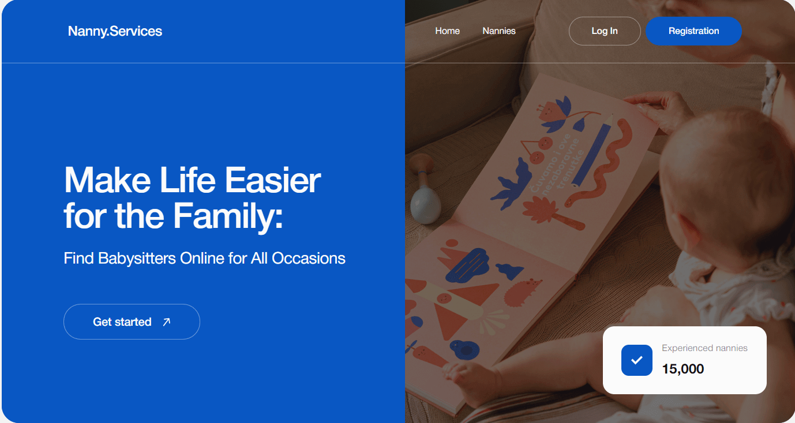

# Nanny services

Nanny services is online platform designed to help parents find and select qualified nannies for their children. Our service provides a convenient and efficient way for parents to choose nannies who meet their specific requirements and ensure the best care for their kids.

## Key features

1. Registration and login. Users can register on the platform or login using their email addresses.
2. Get overview. Users have the ability to browse information to get a more detailed info about every nanny in the list.
3. Filter. Users can filter nannies list according to their requirements.
4. To schedule a meeting. By filling out a modal form, it is possible to schedule a meeting with the selected nanny.
5. Favorite list (Only for authorized users). Users have the opportunity to add nanny card to the favorites and delete it from the personal favorite list. Also there is the ability to filter the list.

## Technologies and Tools Used

### Languages:

- JavaScript
- HTML5
- CSS3

### Libraries and Frameworks:

- React
- Redux Toolkit
- Styled-components
- React hook form
- Yup
- Redux-persist
- React-toastify

### Backend and Deployment:

- Firebase
- Vercel

### Development utilities:

- Vite
- VS Code
- Git

## Links

Model [figma](https://www.figma.com/design/u36ajEOsnwio2GDGiabVPD/Nanny-Sevices?node-id=0-1&t=qHeU6fQGOskfZAiE-0)

[Technical specification](https://docs.google.com/document/d/19ugM1gvOw81nCyALr4EZs3dmv6OfJm94VjupcytbnJY/edit)

## Contributor

AlinaTantsura - Developer

- [GitHub](https://github.com/AlinaTantsura)
- [LinkedIn](https://www.linkedin.com/in/alina-tantsura/)
